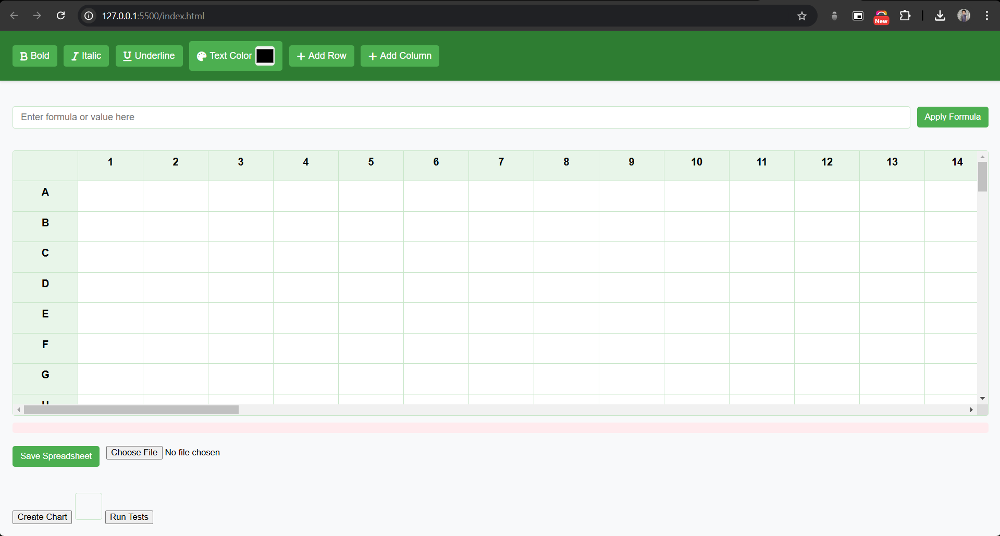

# Spreadsheet Application

This project is a custom spreadsheet application built using HTML, CSS, and JavaScript. It offers a feature-rich and interactive user experience, mimicking functionalities of popular spreadsheet software.



## Features

### Core Features

- **Cell Selection and Input**: Click on any cell to edit its content.
- **Row and Column Management**: Add or delete rows and columns dynamically.
- **Formatting Options:** Apply bold, italic, underline, and text color formatting to cells.
- **Drag-and-Drop:** Copy formulas and content by dragging across cells.
- **Data Persistence**: Save and load data to/from local storage.

### Mathematical Functions

The application supports the following mathematical functions:

- **SUM:** Calculate the sum of a range of cells (e.g., `=SUM(A1:A5)`).
- **AVERAGE:** Calculate the average of a range of cells (e.g., `=AVERAGE(A1:A5)`).
- **MAX:** Find the maximum value in a range of cells (e.g., `=MAX(A1:A5)`).
- **MIN:** Find the minimum value in a range of cells (e.g., `=MIN(A1:A5)`).
- **COUNT:** Count the number of numeric cells in a range (e.g., `=COUNT(A1:A5)`).

### Data Quality Functions

- **TRIM:** Remove leading and trailing spaces in a cell.
- **UPPER:** Convert text in a cell to uppercase.
- **LOWER:** Convert text in a cell to lowercase.
- **REMOVE_DUPLICATES:** Remove duplicate rows from a selected range.
- **FIND_AND_REPLACE:** Find and replace specific text within a range of cells.

### Advanced Features

- **Cell Styling**: Apply text formatting such as bold, italic, and underline to selected cells.
- **Find and Replace**: Locate specific text within a range of cells and replace it with new content.
- **Formula Support**: Perform calculations within cells using mathematical expressions.

## File Structure

- **index.html**: The main HTML file that structures the layout.
- **style.css**: Contains the styles for the spreadsheet, including layout and formatting.
- **script.js**: JavaScript logic for handling user interactions and data processing.

## Installation

1. Clone the repository:
   ```bash
   git clone hhttps://github.com/sathwikbalu/Sheets.git
   ```
2. Navigate to the project directory:
   ```bash
   cd Sheets
   ```
3. Open the `index.html` file in your browser.

## Usage

1. **Editing Cells**: Click on any cell and start typing to edit its content.
2. **Adding Rows/Columns**:
   - Use the respective buttons to add new rows or columns.
   - Delete existing rows or columns using the provided controls.
3. **Saving Data**: Click the save button to store the current data in local storage.
4. **Loading Data**: Use the load button to retrieve saved data.
5. **Styling**: Select a cell and use the bold, italic, or underline options to format text.
6. **Find and Replace**:
   - Enter the text to search for and the replacement text.
   - Specify the range of cells for the operation and execute the find-and-replace action.

## Dependencies

This project uses vanilla JavaScript, HTML, and CSS with no external libraries.

## Future Enhancements

- **Export/Import**: Add options to export data to CSV or Excel and import external files.
- **Multi-Cell Selection**: Enable simultaneous editing of multiple cells.
- **Advanced Formula Support**: Introduce support for more complex formulas and functions.
- **Collaboration**: Implement real-time editing and collaboration features.

## License

This project is licensed under the [MIT License](LICENSE).

## Contact

For questions or feedback, please contact:

- **Name**: Laxmi Sathwik Dandaboina
- **Email**: dlsathwik@gmail.com
- **Phone**: 970585768
